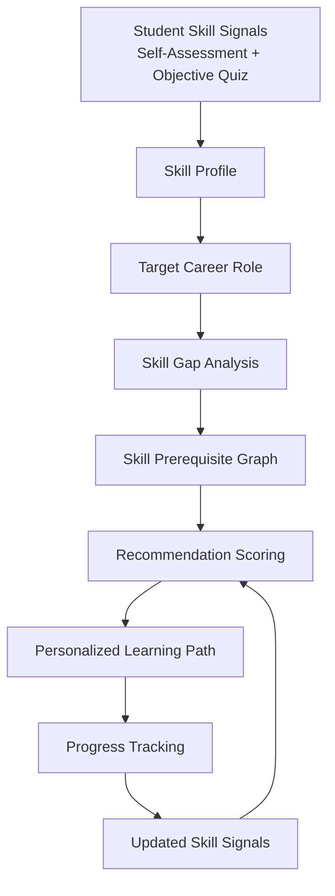
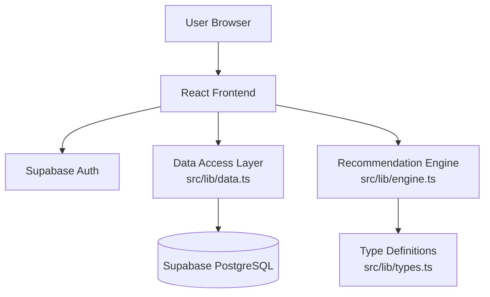
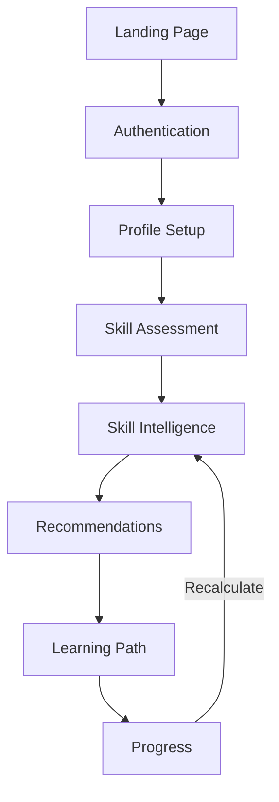
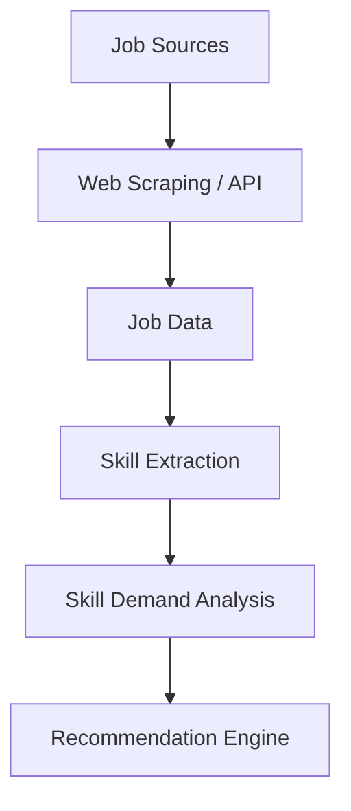

# Adaptive Learning Path Recommendation Engine

An algorithmic recommendation and intelligence platform that analyzes student skill signals, identifies career-related skill gaps, and generates personalized, prerequisite-aware learning paths.

---

## Overview

The Adaptive Learning Path Recommendation Engine is a web application that helps students and career-switchers understand exactly where they stand relative to a target career role. Rather than offering a generic course list, the system ingests a user's self-assessed and objectively-verified skill signals, compares them against role-specific skill requirements, and produces a ranked, explainable learning path.

The engine is designed for students, bootcamp graduates, and self-taught learners who need a data-driven answer to the question: *"What should I learn next, and why?"*

---

## Problem Statement

Learners pursuing a target career role frequently face several unknowns:

- **Which skills are required** for the role they want
- **Which skills they are missing** entirely
- **What they should learn first** given limited time
- **Which skills have prerequisites** that must be completed before advancing
- **How their learning path should change** as their skills improve over time

This project addresses those unknowns by combining a structured skill taxonomy, a prerequisite graph, role-specific skill requirements, and a weighted recommendation scoring algorithm to produce a transparent, personalized learning path.

---

## Core Workflow



---

## Key Features

| Feature | Description |
|---|---|
| **Student Profile** | Captures name, education level, experience level, interests, and target career role. |
| **Career Role Selection** | Choose from a set of predefined roles (Frontend Developer, Backend Developer, Full-Stack Developer, Python Developer, Data Analyst, Data Scientist, DevOps Engineer). Roles are data-driven and extensible. |
| **Skill Assessment** | Two-phase assessment: self-assessment on a 0–5 scale per skill, followed by objective multiple-choice questions. Results are blended (40% self-assessment, 60% objective score) for a stronger signal. |
| **Skill Taxonomy** | Skills are organized into categories (Frontend, Backend, Database, DevOps, Cloud, Data) with difficulty (1–5) and importance (low/medium/high) metadata. |
| **Skill-Gap Analysis** | Compares current skill levels against role-required levels and categorizes each skill as strong, moderate, weak, or missing. Identifies critical gaps (high-importance skills with large deficits). |
| **Recommendation Engine** | A weighted multi-factor scoring algorithm that ranks skills by priority. Each recommendation includes a transparent explanation of why it was ranked. |
| **Skill Prerequisite Graph** | A many-to-many self-referential graph on skills. Prerequisites are checked during scoring and path generation to ensure correct learning order. |
| **Personalized Learning Path** | An ordered sequence generated via prerequisite-aware topological traversal. Items are marked as completed, current, recommended, locked, or upcoming. |
| **Progress Tracking** | Users can mark skills as not started, in progress, or completed. Progress feeds back into the recommendation engine on recalculation. |
| **Recommendation Explanations** | Every recommendation surfaces the individual factor scores and human-readable reasons behind its priority. |
| **Authentication** | Email/password authentication via Supabase Auth with protected routes. |
| **Responsive Interface** | Dark-themed, responsive UI built with Tailwind CSS and Lucide icons. |

---

## Recommendation Engine

The recommendation engine is a **rule-based weighted scoring algorithm**. It does not use machine learning. Every recommendation is fully explainable.

### Inputs

| Input | Source |
|---|---|
| Role skills (required level + importance) | `role_skills` table |
| Student skill levels | `student_skills` table |
| Prerequisite relationships | `skill_prerequisites` table |
| Skill metadata (difficulty) | `skills` table |
| Learning progress | `learning_progress` table |

### Scoring Formula

Each skill with a gap > 0 receives a priority score:

```
Priority Score =
    Skill Gap       × 0.30
  + Role Relevance   × 0.20
  + Importance       × 0.20
  + Prerequisite Fit × 0.20
  + Difficulty Fit   × 0.10
```

**Factor definitions:**

| Factor | Calculation |
|---|---|
| **Skill Gap** | `(required_level − current_level)` normalized to 0–100 |
| **Role Relevance** | 95 if required level > 80, 80 if > 65, otherwise 65 |
| **Importance** | Importance weight × 100 (high=1.0, medium=0.8, low=0.6) |
| **Prerequisite Fit** | 100 if no prerequisite gaps, otherwise `100 − 30 × number_of_unmet_prereqs` |
| **Difficulty Fit** | `100 − abs(difficulty − 3) × 10` (rewards mid-range difficulty) |

### Skill Gap Categorization

| Category | Condition |
|---|---|
| **Missing** | Current level = 0 |
| **Weak** | Gap > 20 |
| **Moderate** | 0 < gap ≤ 20 |
| **Strong** | Current level ≥ required level |

### Career Readiness

Overall readiness is a weighted average of the ratio `current_level / required_level` across all role skills, weighted by importance:

```
Readiness = Σ(ratio × importance_weight) / Σ(importance_weight) × 100
```

---

## Skill Taxonomy and Skill Graph

Skills are organized into categories and connected through a prerequisite graph stored in the `skill_prerequisites` table (a many-to-many self-referential relationship on `skills`).

### Categories

| Category | Examples |
|---|---|
| Frontend | HTML, CSS, JavaScript, React |
| Backend | REST API, Node.js, Python |
| Database | SQL, PostgreSQL |
| DevOps | Docker, CI/CD |
| Cloud | AWS, Cloud Services |
| Data | Data Analysis, Machine Learning |

### Prerequisite Graph

Prerequisites are traversed during both scoring and path generation. If a skill's prerequisite is below 70% of the required level for the target role, it is flagged as an unmet prerequisite gap. Skills with unmet prerequisites are marked as **locked** in the learning path.

Example chain (actual relationships depend on seeded data):

```
HTML → CSS → JavaScript → React → REST API → Backend
```

---

## Personalized Learning Path

The learning path is generated **algorithmically**, not statically. The process:

1. **Generate recommendations** — All skills with a gap > 0 are scored and sorted by priority.
2. **Topological ordering** — A depth-first traversal of the prerequisite graph ensures prerequisites appear before dependent skills.
3. **Status assignment** — Each item is marked as:
   - `completed` — already completed or current level ≥ required level
   - `current` — prerequisites met, ready to learn now
   - `recommended` — next in sequence
   - `locked` — prerequisites not yet satisfied
   - `upcoming` — further down the path

### Adaptive Behavior

The system supports **recalculation**: users can regenerate their learning path after updating progress or retaking the assessment. The engine recomputes gaps, scores, and ordering with the latest skill signals. Recalculation is triggered manually via the "Recalculate" / "Regenerate Path" buttons.

---

## Technology Stack

### Frontend

| Technology | Role |
|---|---|
| React 18 | UI framework |
| TypeScript | Type-safe application logic |
| Vite 5 | Build tool and dev server |
| React Router 7 | Client-side routing |
| Tailwind CSS 3 | Utility-first styling |
| Lucide React | Icon library |

### Database

| Technology | Role |
|---|---|
| Supabase (PostgreSQL) | Managed database with Row Level Security |

### Authentication

| Technology | Role |
|---|---|
| Supabase Auth | Email/password authentication with session persistence |

### Development Tools

| Tool | Role |
|---|---|
| npm | Package manager |
| ESLint 9 | Linting |
| TypeScript ESLint | TypeScript-specific lint rules |
| GitHub Actions | CI/CD for GitHub Pages deployment |

---

## Architecture



The application is a **client-side single-page application**. The recommendation engine runs entirely in the browser — there is no separate backend server. Data persistence and authentication are handled by Supabase, which the frontend communicates with directly using the Supabase JS client.

---

## Project Structure

```
src/
├── components/
│   ├── layout/
│   │   ├── AppLayout.tsx       # Shell layout with sidebar
│   │   └── Sidebar.tsx          # Navigation sidebar
│   └── ui/
│       ├── Badge.tsx            # Badge and importance badge
│       ├── ProgressBar.tsx      # Reusable progress bar
│       └── States.tsx           # Loading, empty, and error states
├── context/
│   └── AuthContext.tsx          # Supabase auth provider and hook
├── lib/
│   ├── data.ts                  # Supabase data access layer (CRUD)
│   ├── engine.ts                # Recommendation engine (scoring, gaps, path)
│   ├── supabase.ts              # Supabase client initialization
│   ├── types.ts                 # TypeScript type definitions
│   └── utils.ts                 # Utility functions
├── pages/
│   ├── AuthPage.tsx             # Sign in / sign up
│   ├── LandingPage.tsx          # Marketing landing page
│   └── app/
│       ├── AssessmentPage.tsx    # Self-assessment + objective quiz
│       ├── IntelligencePage.tsx  # Skill gap analysis dashboard
│       ├── LearningPathPage.tsx  # Ordered learning path visualization
│       ├── OverviewPage.tsx      # Dashboard with readiness summary
│       ├── ProfileSetupPage.tsx  # Profile and target role selection
│       ├── ProgressPage.tsx      # Progress tracking per skill
│       └── RecommendationsPage.tsx # Ranked recommendations with explanations
├── App.tsx                      # Root component with routing
├── main.tsx                    # Application entry point
└── index.css                    # Tailwind directives and global styles

supabase/
└── migrations/
    └── 20260825142411_create_schema.sql  # Full database schema with RLS

.github/
└── workflows/
    └── deploy.yml               # GitHub Pages deployment workflow

public/
└── 404.html                     # SPA fallback for GitHub Pages routing
```

---

## Installation

### Prerequisites

- Node.js 18+ (Node 20 recommended)
- npm

### Setup

```bash
# Clone the repository
git clone https://github.com/vidhya-2332/Learning-path-engine.git
cd Learning-path-engine

# Install dependencies
npm install

# Start the development server
npm run dev
```

### Environment Variables

The application requires Supabase configuration via environment variables. Create a `.env` file in the project root:

```env
VITE_SUPABASE_URL=your_supabase_project_url
VITE_SUPABASE_ANON_KEY=your_supabase_anon_key
```

These values are read at build time by Vite. Never expose the Supabase service role key in the frontend.

---

## Available Scripts

| Script | Command | Description |
|---|---|---|
| Dev | `npm run dev` | Starts the Vite development server with hot module replacement |
| Build | `npm run build` | Compiles TypeScript and builds the production bundle to `dist/` |
| Preview | `npm run preview` | Serves the production build locally for preview |
| Lint | `npm run lint` | Runs ESLint across the project |
| Typecheck | `npm run typecheck` | Runs the TypeScript compiler in no-emit mode for type validation |

---

## Environment Variables

| Variable | Required | Description |
|---|---|---|
| `VITE_SUPABASE_URL` | Yes | Supabase project URL |
| `VITE_SUPABASE_ANON_KEY` | Yes | Supabase anonymous (public) key |

No other environment variables are required. No secrets are committed to the repository — `.env` is gitignored.

---

## API / Backend

The application does not have a custom backend server. All data operations go through the Supabase client directly from the browser:

- **Reference data** (skills, categories, prerequisites, roles, role_skills, assessment_questions) is publicly readable via RLS policies scoped to `anon, authenticated`.
- **Student data** (profiles, skills, assessment results, learning paths, progress) is scoped to the authenticated owner via RLS policies using `auth.uid() = user_id`.

The data access layer (`src/lib/data.ts`) wraps all Supabase queries and exposes typed async functions for the UI components.

---

## Screens / User Experience



| Route | Page | Purpose |
|---|---|---|
| `/` | Landing Page | Marketing overview with workflow explanation and supported roles |
| `/auth` | Authentication | Sign in or create an account |
| `/app` | Overview | Dashboard with career readiness score, quick links, and top recommendations |
| `/app/profile` | Profile Setup | Set name, education, experience, target role, and interests |
| `/app/assessment` | Skill Assessment | Self-assess skills and answer objective questions |
| `/app/intelligence` | Skill Intelligence | Career readiness analysis with strong/weak/missing/moderate breakdown |
| `/app/recommendations` | Recommendations | Ranked skill recommendations with expandable explanations |
| `/app/path` | Learning Path | Ordered, prerequisite-aware learning path with status indicators |
| `/app/progress` | Progress | Per-skill learning status tracking and assessment history |

---

## Security

| Mechanism | Implementation |
|---|---|
| **Authentication** | Supabase Auth with email/password. Sessions are persisted and auto-refreshed. |
| **Protected Routes** | The `/app` route and all sub-routes are wrapped in a `ProtectedRoute` component that redirects unauthenticated users to `/auth`. |
| **Row Level Security** | RLS is enabled on every database table. Reference tables allow public read; student tables enforce `auth.uid() = user_id` for all CRUD operations. |
| **Environment Variables** | Supabase keys are loaded via Vite environment variables and never committed. The `.env` file is gitignored. |
| **Owner-Scoped Writes** | All student data inserts and updates are constrained by RLS policies to the authenticated owner. |

---

## Testing

Automated testing is planned as a future engineering enhancement. No test suite is currently implemented.

---

## Deployment

The project is configured for deployment to GitHub Pages via GitHub Actions.

### Build

```bash
npm run build
```

This produces a production bundle in the `dist/` directory. The `dist/` folder is gitignored and is not committed — it is built during the CI/CD pipeline.

### GitHub Pages Configuration

- **Vite base path**: Set to `/Learning-path-engine/` so all assets load from the correct subpath.
- **Router basename**: `BrowserRouter` uses `basename="/Learning-path-engine"` for correct client-side routing.
- **SPA fallback**: `public/404.html` redirects deep links back to the app so the router can handle them.
- **CI/CD workflow**: `.github/workflows/deploy.yml` triggers on pushes to `main`, installs dependencies, runs `npm run build`, and deploys the `dist/` folder using the official GitHub Pages actions.

### Live Demo

Live Demo: https://vidhya-2332.github.io/Learning-path-engine/
Repository: https://github.com/vidhya-2332/Learning-path-engine

---

## Future Enhancements

### Job Market Intelligence



Integrating real job market data to weight recommendations by current skill demand.

### Machine Learning

- Content-based recommendation using skill similarity
- Collaborative filtering across learner cohorts
- Ranking models trained on learning outcome data
- Hybrid recommendation combining rule-based and ML approaches
- NLP-based skill extraction from job descriptions

### Infrastructure

- Background processing for large-scale path recalculation
- Caching layer for recommendation results
- Monitoring and analytics for recommendation effectiveness
- Scalable recommendation service architecture

---

## Engineering Purpose

This project is more than a conventional CRUD application. The engineering concepts implemented include:

- **Data Modeling** — A normalized schema with 11 tables covering skill taxonomy, role requirements, student signals, and learning paths.
- **Skill Taxonomy** — Structured categorization of skills with difficulty and importance metadata.
- **Graph Relationships** — A many-to-many prerequisite graph enabling dependency-aware path generation.
- **Skill-Gap Analysis** — Quantitative comparison of current vs. required skill levels with categorical classification.
- **Recommendation Algorithm** — A weighted multi-factor scoring model with five distinct factors and tunable weights.
- **Explainable Recommendations** — Every recommendation surfaces its factor scores and human-readable reasons.
- **Prerequisite-Aware Path Generation** — Topological ordering ensures learning dependencies are respected.
- **Personalization** — Paths are generated per user based on their unique skill signals and target role.
- **Adaptive Recalculation** — The engine recomputes recommendations when skill signals or progress change.

---

## Project Status

**Status: MVP / In Development**

The core recommendation engine, skill-gap analysis, prerequisite graph traversal, learning path generation, progress tracking, and authentication are implemented and functional. Job market intelligence, machine learning-based recommendations, and infrastructure scaling are planned future work.
